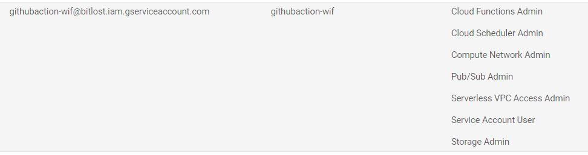
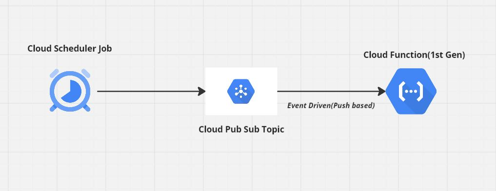
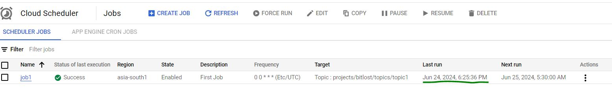
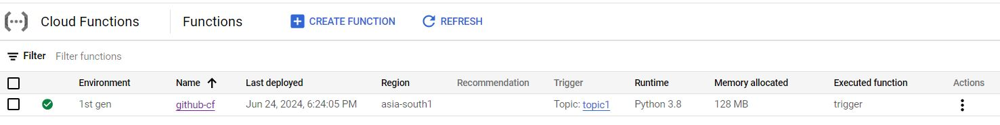
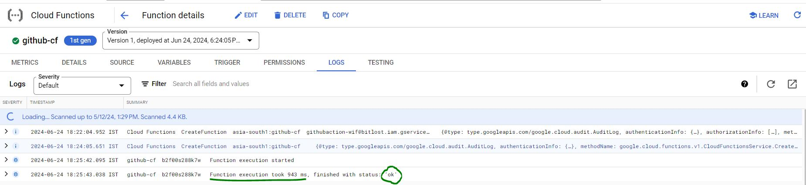

# Capstone-Serverless
This repo Demonstrates Deploying Event Driven Cloud Function on GCP Serverless Platform.

### Pre-Requisites:

- Below GCP API's Enabled:
   - Cloud Scheduler API
   - Cloud Pub/Sub API
   - Serverless VPC Access API
   - Cloud Functions API
   - Cloud Build API
   - Cloud Logging API
   - Secret Manager API
   - Security Token Service API

- Service Account for Deploying Infra.

- Cloud Function Runtime Service Account needed to communicate with GCP Resources.

### Security Best Practice:

- Workload Indentity Federation is used for GCP Authentication with Github Actions.

- Google Secret Manager Service used to store any secrets/passwords used by Cloud Function.

### Serverless HLD:

<!-- ### Serverless Flow Validation:

- Cloud Scheduler Job Run:

 -->

<!-- - Cloud Function:

 -->

<!-- - Cloud Function Logs:

 -->

