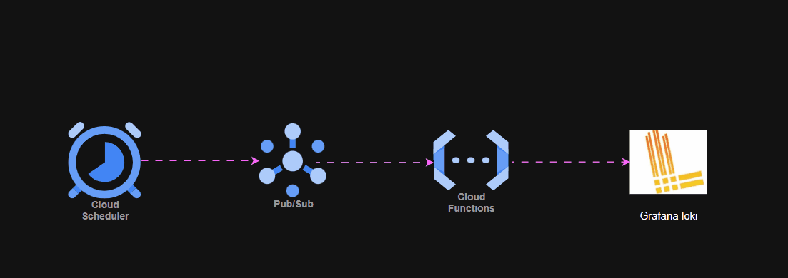
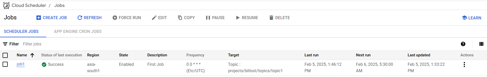
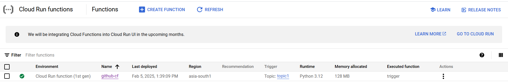
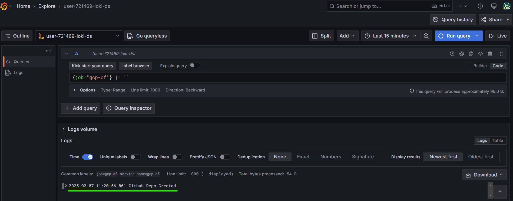

# Capstone-Serverless
This repo demonstrates deploying Event Driven Cloud Function using Terraform & Github Actions on Google Cloud Platform. 

It also has integration related to Static Code Scanning of Terraform Code using KICS tool and Cloud Function logs being visualized on Grafana Loki Platform.

### Pre-Requisites:

- Below GCP API's Enabled:
   - Cloud Scheduler API
   - Cloud Pub/Sub API
   - Serverless VPC Access API
   - Cloud Functions API
   - Cloud Build API
   - Cloud Logging API
   - Secret Manager API
   - Security Token Service API

- Service Account for Deploying Infra.

- Cloud Function Runtime Service Account needed to communicate with GCP Resources.

### Security Best Practice:
- Static Code Scanning of Terraform Code using KICS tool.

- Workload Indentity Federation is used for GCP Authentication with Github Actions.

- Google Secret Manager Service used to store any secrets/passwords used by Cloud Function.

### Static Code Scanning Results:

**SARIF results uploaded to Github**

### Serverless Flow:

### Serverless Validation:

- Cloud Scheduler Job Run:

- Cloud Function:

- Cloud Function Logs to Grafana Loki:

