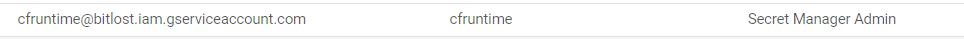

# Capstone-Serverless
This repo Demonstrates Deploying Event Driven Cloud Function on GCP Serverless Platform.

### Pre-Requisites:

- Below GCP API's Enabled:
   - Cloud Scheduler API
   - Cloud Pub/Sub API
   - Serverless VPC Access API
   - Cloud Functions API
   - Cloud Build API
   - Cloud Logging API
   - Secret Manager API
   - Security Token Service API

- GCP Service Account for Deploying Infra.

<!-- - GCP Runtime Service Account to be used by Cloud Function with Other GCP Resources.

 -->

### Security Best Practice:

- Workload Indentity Federation is used for GCP Authentication.

- Github Actions is used to deploy Cloud Function.

- Terraform with Github Action is used to  deploy GCP Cloud Infra.

<!-- - Google Secret Manager Service should be used to store any secrets/passwords used by Cloud Function code and to be imported as  Secret Environment Variables. -->

### Serverless HLD:

<!-- ### Serverless Flow Validation:

- Cloud Scheduler Job Run:

 -->

<!-- - Cloud Function:

 -->

<!-- - Cloud Function Logs:

 -->

